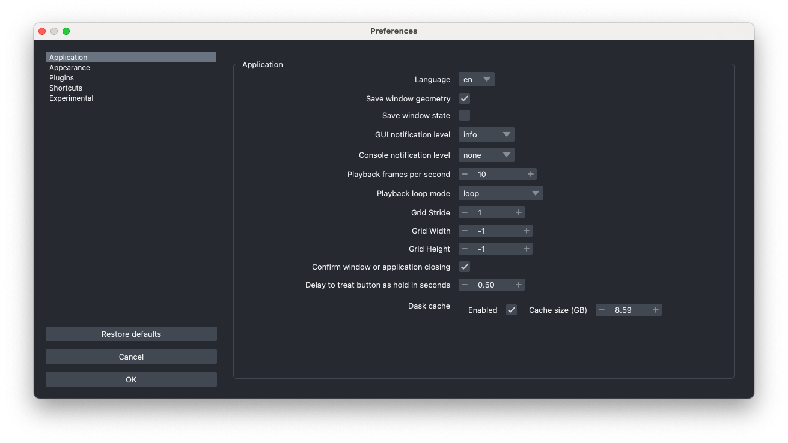

# The napari application

```{note} This content was based on [material from a workshop](https://github.com/dgmccart/intro-to-napari-workshop) prepared by Dannielle McCarthy (@dgmccart), Sean Martin (@seankmartin), and Melissa Weber Mendonça (@melissawm).
```
For full documentation of the napari viewer, please see [the Viewer tutorial](https://napari.org/stable/tutorials/fundamentals/viewer.html) in the napari docs. Here we will just have an overview.

## Launch napari

For this introduction, we will launch the napari application directly from the terminal.

````{important}
Remember to activate the right environment!

```bash
conda activate napari-workshop
```
````

Once you have the proper environment active, you can launch napari by typing `napari`:

```bash
napari
```

After a few seconds (or up to a minute if it's the first launch and you have various security and antivirus software installed), you will get the `viewer` window, which is annotated below:

  


## Open an Image
  
* Open a sample image that comes with napari by selecting:  
**File** > **Open Sample** > **napari builtins** > **Cells (3D + 2Ch)**  


   **Note:** Open one of your own images with:  
**File** > **Open files** and select a tif, png, or jpg file to open—or drag-n-drop one onto
the canvas.

```{note} By default, napari can open (and save) a wide range of non-proprietary file formats. For proprietary image formats, you will need to install an appropriate plugin. You can search the [napari-hub](https://napari-hub.org) to find one!
```

## Explore Images in 2D and 3D  

* Toggle layer visibility on and off with the **eye button to the left of the layer name** in the layer list.  

* Use the dimension sliders beneath the canvas to  control the z position/slice number. Slide through the 3D stack one 2D slice at a time.  

* Scroll (use two finger scroll on a touchpad) to zoom in and out.  

* Click and drag to move the images in the canvas.  

* Press the `home` button to bring the image back to the center of the canvas.  
  
It is on the right end of the row of viewer buttons.  

* Explore images in 3D by toggling the `2D/3D` button.  When you're in 2D mode, it looks like this:  
  
When you're in 3D mode, it looks like this:  
  
It is second from the left end on the row of viewer buttons.
* Click and drag on the 3D image to rotate.
* Shift + click and drag to translate (move) the 3D image.  
* Scroll to zoom in and out of the 3D volume.
* Move the _nuclei_ and _membrane_ images to be side-by-side by toggling the `grid mode` button; it's the second button from the right end on the row of viewer buttons and acts as a toggle. 
  
 
## Adjust Image Visualization   
* Select an image from the layers list (selected images are blue in the layer list).  
* Adjust the contrast limits by using the contrast limits slider in the layer controls section.

    ```{tip} You can Control+click (Mac) or right-click (Windows and Linux) on the slider to open the expanded view with min and max pixel values labeled on the ends of the slider.

    ```  
* Adjust opacity, color map, and blending modes in the layer controls section.  

## Explore Stack Manipulation  
* Select both the nuclei and membrane layers in the layer list using shift+click.
* Control+click (Mac)/right-click (Windows and Linux) either of the selected layers to open the layer actions menu. 


    ```{note}
    The layer actions menu is contextually aware, so it will have different options enabled depending on the
    layer(s) that is selected.
    ```

    * Merge layers:	
        * With both layers selected, click **Merge to Stack** to combine the **nuclei** and **membrane** layers to make a single layer with an additional slider that controls the channel axis.  
    * Rename this layer to **cells** by double clicking the layer in the layer list and replacing the text.  
    * Rename the dimension sliders at the bottom of the canvas to read **Ch** and **Z** by double clicking the **0** and **1** on the left side of the sliders and replacing the text.  

    * Explore the data using the sliders.  
    * Open the layer action menu and split the stacks with the **Split Stack** command.  

        ```{note}
        **Split Stack** divides a layer in its *first listed dimension*, which would have index `0` and should be represented by the bottom-most slider. In this case, selecting the newly merged layer will separate the channels into separate layers. Meanwhile, applying **Split Stack** to one of the resulting layers will split the layer into a set of 2D layers for each of the z slices.

        ```

## Explore Layer Types  

The Points, Shapes, and Labels layers can be used for annotating you image layers and are accessible 
through the GUI buttons. Additional data layers (Surfaces, Tracks, and Vectors) are available through 
the API. For guides to using the various layer types, please see the [napari layer guides](https://napari.org/stable/howtos/layers/index.html).


* Add a points, shapes, or labels layer using the buttons above the layers list.
    * These layers will be blank to begin with.  
    * In 2D mode, use the layer controls to add points, draw some shapes, or paint some labels on your image (referring to points, shapes, and labels layers respectively).
* Re-order the layer list by dragging a selected layer in the list below another. Depending on the blending and opacity settings, this will change the visualization!

```{tip}
You can delete layers selected individually using the trash can icon or by pressing the backspace key.
Delete all layers in the layer list by selecting one layer, and then pressing Command+A (Mac) / Control+A (Windows and Linux) to select all layers. Then click the trash can button on the top right of the layer list. 

```

## Save your data

There are two options for saving your data: saving the layers themselves or saving the rendered view
in the canvas. 

To save the currently rendered view, use the File menu **Save Screenshot**. You can also choose to include

the viewer or to save the screenshot to the clipboard instead of a file.

You can save the layers individually using the File menu or Command+S (Mac) / Control+S (Windows and Linux). 

* For image layers, you can select the file type by providing the extension. 
Note: Some formats may not work for all image types, e.g. 3D stacks. Additional file types 
can be made available by plugins.
* Points and Shapes layers are saved as `.csv` files that contain their coordinates.
* Labels layers are saved as `.tiff` files.

Multiple different layer types, e.g. image and points, can be saved to a single `.svg` file,
which can be convenient for use in a vector graphics program or for web. 
* Select more than one layer and use the File menu or Command+S (Mac) / Control+S (Windows and Linux), then in the dialog dropdown menu ensure `napari SVG` is selected, give the file a name, and save.


    ```{important} 
    The output file will not be openable in napari!
    ```

Perhaps more usefully, multiple different layer types, e.g. image and points, can be saved as
individual layers (as described above) *to a folder.* 
* Select more than one layer and use the File menu or Command+S (Mac) / Control+S (Windows and Linux) or use Command+Option+S (Mac) / Control+Alt+S (Windows and Linux) to save all layers. Then in the dialog dropdown menu change `napari-svg` to `napari builtins Save to Folder`. Enter a folder name and hit save. A new folder with that name will be created and the files will be individually exported there, as noted above.

    ```{important} 
    To re-open the files, open the enclosing folder, select all the files, and drag-n-drop them on the napari canvas. At present, opening the folder directly, if it contains a mix of layer types, will not work—only images are supported in this way. Note that a folder of images will be imported as a stack.
    ```

## The Preferences/Settings

Here you can customize the behavior of napari, e.g. keybindings, as well as
the look (e.g. themes).
* Access the Settings on Windows/Linux in the **File** menu or the Preferences in the **napari** menu on macOS

    * Be sure and check the extensive, editable keyboard shortcuts!

```{note}
- Preferences/Settings are stored *per Python environment*. 
- They can reset using `napari --reset` in the terminal
```

## Use the integrated Python console to interact with the viewer

```{tip}
You may want to delete any unneeded layers and/or re-open the Cells3D sample file.
```

* Open the integrated console with the first button on the row of the viewer control buttons.  


    ```{important}
    The integrated Python console is only available if napari was started from a non-interactive session, meaning the terminal (using `napari`) or a script. If you are already in an interactive session, like iPython or a notebook, keep using that!
    ```
* Get the layer list programmatically; enter:

    ```python
    viewer.layers
    ```

* Adjust the scale of an image. If you have just the `nuclei` and `membrane` image layers, you can provide micron to pixel scale information for the `nuclei` layer as follows:

    ```Python
    viewer.layers['nuclei'].scale = [0.35, 0.2, 0.2]
    ```

Alternatively, you could use the index of the layer instead. 

* If you want to change the scale of all layers, enter the following commands one line at a time, ensuring an indent on the second line, as shown below: 

    ```python
    for layer in viewer.layers:  
        layer.scale = [0.35, 0.2, 0.2]
    ```

```{important} 
If your layers disappeared, you will need to click the `home` button to reset the viewer and you may need to adjust the slider to a new slice
```

* Add a scale bar using the GUI **View** > **Scale Bar** > **Scale Bar Visible** or by typing 

`viewer.scale_bar.visible = True`  in the integrated console. 
* Add physical units of microns to the scale bar by typing `viewer.scale_bar.unit = "um"`  
in the integrated console.
* Try zooming in and out of the image, while watching the scale bar!

````{tip}
The integrated console is a full-featured iPython kernel. You can use it for interactive
analysis, just import `numpy` or `skimage`. You can use `tab` for auto-completions and the Up
arrow to access the command history. Use a `?` to access documentation, e.g.

    
```
viewer?
```

````
